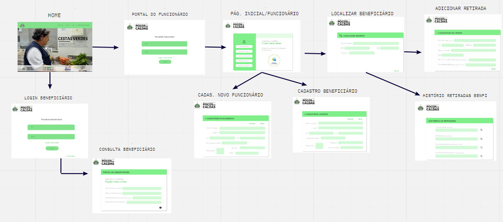

# Arquitetura da Solução

O referido projeto foi estruturado com o auxílio de algumas ferramentas essenciais para a obtenção de resultados satisfatórios. Para o desenvolvimento em HTML5, CSS3 e Javascript, está sendo utilizado o editor de código Visual Studio Code.

Para sestabelecer a comunicação entre os participantes do grupo, está sendo utilizado o Teams e o Google Meet como canal de comunicação oficial, e o Whatsapp como canal de comunicação informal, onde ocorre o compartilhamento de materiais e agendamentos de dailys. 
Para a prototipação de interfaces, utilizamos o Figma. O diagrama e a arquitetura foram elaborados com o Miro. 

Como hospedagem do projeto será utilizado Heroku. E, para o gerenciamento e versionamento do projeto, utilizamos o GitHub, facilitando o controle de versões de um software ou aplicação.

## Diagrama de componentes

Diagrama que permite a modelagem física de um sistema, através da visão dos seus componentes e relacionamentos entre os mesmos.

Exemplo: 

Os componentes que fazem parte da solução são apresentados na Figura XX.

Figura XX - Arquitetura da Solução

A solução implementada conta com os seguintes módulos:
- **Navegador** - Interface básica do sistema  
  - **Páginas Web** - Conjunto de arquivos HTML, CSS, JavaScript e imagens que implementam as funcionalidades do sistema.
   - **Local Storage** - armazenamento mantido no Navegador, onde são implementados bancos de dados baseados em JSON. São eles: 
     - **Canais** - seções de notícias apresentadas 
     - **Comentários** - registro de opiniões dos usuários sobre as notícias
     - **Preferidas** - lista de notícias mantidas para leitura e acesso posterior
 - **Hospedagem** - local na Internet onde as páginas são mantidas e acessadas pelo navegador. 

## Diagrama de Solução

A imagem a seguir ilustra a o fluxo do usuário em nossa solução. Assim
que o usuário entra na plataforma, ele é apresentado à tela inicial
(Tela 1 HOME) onde ele é confrontado com as opções SOBRE NÓS, CONTATO, 
LOGIN E PORTAL DO FUNCIONÁRIO.

Caso ele opte pelo caminho login será redirecionado para a (Tela 9 PORTAL DO BENEFICIÁRIO), 
onde ao logar ele sera redirecionado para a (Tela 10 PÁGINA INICIAL-CONSULTA BENEFICIÁRIO) 
onde ele pode visualizar o local e data da última retirada, a próxima data de retirada e 
alterar o local de retirada.

Caso opte pelo  (PORTAL DO FUNCIONÁRIO), ele é redirecionado para a 
(Tela 2 LOGIN PORTAL DO FUNCIONÁRIO), onde haverá opção de login e senha.
Ao logar com seu CPF e senha ele é redirecionado para a 
(Tela 3 PÁGINA INICIAL DO PORTAL DO FUNCIONÁRIO) 
com as opções CADASTRAR USUÁRIO,LOCALIZAR USUÁRIO, HISTÓRICO DE RETIRADAS, 
CADASTRAR RETIRADA, CADASTRAR FUNCIONÁRIO.

Se decidir CADASTRAR FUNCIONÁRIO será redirecionado para a (Tela 4 CADASTRO NOVO FUNCIONÁRIO).

Se decidir CADASTRAR USUÁRIO será redirecionado para a (Tela 5 CADASTRO BENEFICIÁRIO).

Se decidir LOCALIZAR USUÁRIO será redirecionado para a (Tela 6 LOCALIZAR BENEFICIÁRIO).

Se decidir CADASTRAR RETIRADA será redirecionado para a (Tela 7 ADICIONAR RETIRADA) e poderá adicionar a retirada da cesta pelo beneficiário.

Se decidir HISTÓRICO DE RETIRADAS será redirecionado para a (Tela 8 HISTÓRICO RETIRADAS) poderá visualizar todas as retiradas feitas pelo beneficiário.

## Tecnologias Utilizadas

As ferramentas que serão utilizadas no desenvolvimento de software serão Visual Studio Code para o desenvolvimento front-end, para testes e conexões com o banco de dados utilizaremos o Dbeaver, para desenvolvimento Back-End utilizaremos o IntelliJ, por fim, para hospedagem utilizaremos a plataforma Heroku.
Para comunicação, a equipe desfruta das ferramentas Whatsapp, Google Meet, Teams e Discord.
Para versionamento de código, a equipe utiliza a plataforma do Github.
Para aplicar os fundamentos do scrum, mais precisamente com o quadro Kanban, a equipe está utilizando a ferramenta Planner da Microsoft.

## Hospedagem

A hospedagem do projeto será realizada na plataforma Heroku. Plataforma em que é possível realizar além da hospedagem, podemos realizar os testes, configurações e publicações virtuais na núvem, em resumo, será o facilitador para que o deploy e implementação de toda a aplicação possa ser realizada de forma mais otimizada e segura. 
